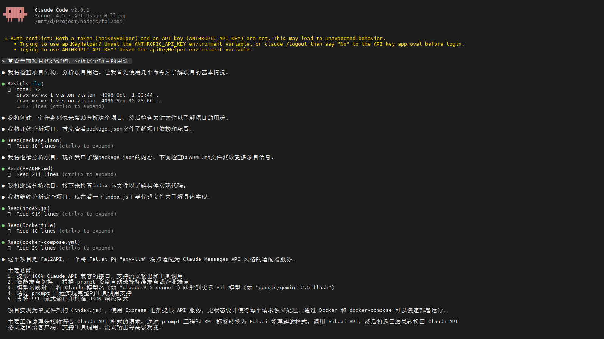

# Fal2Claude - Claude Messages API 适配器

将 Fal.ai 的 `any-llm` 端点适配为 Claude Messages API 格式，通过 **Prompt 工程**为不支持原生工具调用的模型提供完整的 function calling 能力。



## 背景与挑战

Fal.ai 的 `any-llm` 端点提供了统一的 LLM 访问接口，但存在以下限制：

- ❌ **仅支持 2 个参数**：`prompt` 和 `system_prompt`（纯文本）
- ❌ **不支持原生 tools**：无 function calling API
- ❌ **参数长度限制**：标准端点每个参数最多 5000 字符（最近新增的企业端点无限制）

而 Claude Messages API 提供了：
- ✅ 结构化的 messages 数组
- ✅ 原生的 tools 定义和调用
- ✅ 多轮对话上下文管理

**本项目的目标**：在不修改上游 API 的前提下，通过 Prompt 工程实现完整的工具调用能力。

## 核心特性

- ✅ **Prompt 工程实现工具调用** - 为只有 `prompt`/`system_prompt` 的上游提供 function calling
- ✅ **堆栈截断防幻觉** - 确保工具调用后模型停止输出，等待真实结果
- ✅ **智能端点切换** - 根据 prompt 长度自动选择标准或企业端点
- ✅ **模型名称映射** - 灵活映射 Claude 模型名到实际 Fal 模型
- ✅ **完整 Claude API 兼容** - 流式/非流式、多轮对话、工具调用

## 技术方案

### 1. 核心思路：XML 标签 + 约定协议

由于上游只接受纯文本 `system_prompt`，我们将工具定义、调用规则、对话历史全部编码为 XML 结构：

**输入侧（注入 system_prompt）**：
```
<system>
用户的原始 system prompt
</system>

<conversation_history>
  <user>之前的用户消息</user>
  <assistant>之前的助手回复</assistant>
  <tool_result call_id="xxx">工具执行结果</tool_result>
</conversation_history>

<tools>
  <tool name="get_weather">
    <description>获取天气信息</description>
    <parameters>
      <json_schema>{"type":"object","properties":{...}}</json_schema>
    </parameters>
  </tool>
</tools>

<tool_call_rules>
  <rule>只能调用本轮 <tools> 中列出的工具</rule>
  <rule>输出 <tool_calls>...</tool_calls> 后立即停止，不得继续输出</rule>
  <rule>禁止模拟工具执行结果</rule>
  <rule>线性依赖：一次只调用一个工具，等待真实结果后再继续</rule>
  <rule>并行调用：无依赖时可在同一 <tool_calls> 中列出多个</rule>
</tool_call_rules>

<output_format>
仅回答内容（无需工具时）
或
<tool_calls>
  <tool_call name="..." call_id="...">
    <arguments>{...JSON...}</arguments>
  </tool_call>
</tool_calls>
</output_format>
```

**输出侧（模型响应）**：
```
可选的文本回复
<tool_calls>
  <tool_call name="get_weather" call_id="call_xxx">
    <arguments>{"city": "北京"}</arguments>
  </tool_call>
</tool_calls>
```

### 2. 关键设计：堆栈截断防幻觉

**问题**：模型可能在输出 `</tool_calls>` 后继续"幻觉"，例如：
- 自行编造工具执行结果
- 继续模拟下一轮对话
- 输出额外的解释文字

**解决方案**：栈式 XML 解析器 + 第一闭合即停止

```
解析流程：
1. 遇到 <tool_calls> → 入栈
2. 遇到 <tool_call> → 入栈，记录 name 和 call_id
3. 遇到 <arguments> → 入栈，开始收集内容
4. 遇到 </arguments> → 出栈，解析 JSON
5. 遇到 </tool_call> → 出栈，保存工具调用
6. 遇到 </tool_calls> → 出栈，🔒 立即停止解析
```

**关键点**：第 6 步遇到第一个 `</tool_calls>` 闭合标签时，**立即 break**，后续内容全部丢弃。

**效果**：
- ✅ 模型无法在工具调用后继续输出
- ✅ 必须等待下一轮注入 `<tool_result>` 才能继续
- ✅ 强制模型遵循"调用 → 等待 → 结果 → 继续"的流程

### 3. 智能补全与容错

模型输出可能不规范，需要容错处理：

**场景 1**：忘记闭合 `</arguments>`
```
<tool_call name="get_weather">
  <arguments>{"city": "北京"}
</tool_call>  ← 直接跳到这里了
```
**处理**：检测到 `</tool_call>` 时，如果栈顶还是 `arguments`，自动闭合并解析

**场景 2**：JSON 带尾部逗号
```
<arguments>{"city": "北京",}</arguments>
```
**处理**：正则替换 `,}` → `}`，`,]` → `]`

**场景 3**：缺少 input
```
<tool_call name="get_weather" call_id="xxx">
</tool_call>
```
**处理**：自动补充空对象 `{}`

### 4. 历史对话的编码

多轮对话需要将历史压缩到 `system_prompt` 中：

**编码规则**：
- 最后一条消息 → 放入 `prompt` 参数（用户当前问题）
- 其余历史 → 编码为 XML 放入 `system_prompt`

**工具结果的处理**：
```
用户: "北京天气"
助手: <tool_calls>...</tool_calls>  ← 工具调用
用户: [tool_result: {"temp": 15}]   ← 工具结果

编码为：
<conversation_history>
  <user>北京天气</user>
  <assistant_tool_calls>
    <tool_call name="get_weather" call_id="xxx">...</tool_call>
  </assistant_tool_calls>
  <tool_result call_id="xxx">{"temp": 15}</tool_result>
</conversation_history>

当前消息: （助手基于工具结果继续回答）
```

### 5. 端点选择策略

Fal.ai 提供两个端点：
- **标准端点** (`fal-ai/any-llm`)：每个参数 ≤5000 字符
- **企业端点** (`fal-ai/any-llm/enterprise`)：最近新增，无长度限制，成本更高

**选择逻辑**：
```
if (system_prompt.length > 5000 || prompt.length > 5000) {
  使用企业端点
} else {
  使用标准端点
}
```

**优化思路**：
- 工具定义在每轮重复，占用较多空间
- 历史对话会累积增长
- 超过 5000 字符时自动切换，对用户透明

### 6. 伪流式输出

**上游限制**：只有非流式 API (`fal.subscribe()`)

**下游需求**：客户端可能要求 SSE 流式输出

**解决方案**：
1. 上游统一使用非流式调用，获取完整响应
2. 解析完整内容，提取文本和工具调用
3. 下游需要流式时，将内容分块输出：
   - 文本按 15 字符/块输出，间隔 10ms（模拟打字）
   - 工具调用的 JSON 按 20 字符/块输出，间隔 8ms
   - 发送标准 SSE 事件：`message_start` → `content_block_delta` → `message_stop`

**优势**：
- 简化实现，无需复杂的流式状态机
- 上游解析只需处理完整内容，无需处理截断

## 快速开始

### Docker Compose（推荐）

```bash
# 克隆项目
git clone https://github.com/your-username/fal2claude.git
cd fal2claude

# 启动服务
docker-compose up -d

# 查看日志
docker-compose logs -f
```

### 配置说明

在 `docker-compose.yml` 中配置模型映射：

```yaml
environment:
  - MODEL_MAPPING={"claude-sonnet-4-5-20250929":"anthropic/claude-3.7-sonnet"}
```

## API 使用

### 基本对话

```bash
curl http://localhost:8080/v1/messages \
  -H "x-api-key: YOUR_FAL_KEY" \
  -H "Content-Type: application/json" \
  -d '{
    "model": "claude-sonnet-4-5-20250929",
    "messages": [{"role": "user", "content": "你好"}],
    "max_tokens": 1024
  }'
```

### 工具调用

```bash
curl http://localhost:8080/v1/messages \
  -H "x-api-key: YOUR_FAL_KEY" \
  -H "Content-Type: application/json" \
  -d '{
    "model": "google/gemini-2.5-flash",
    "messages": [{"role": "user", "content": "北京现在几点？"}],
    "tools": [{
      "name": "get_current_time",
      "description": "获取指定城市的当前时间",
      "input_schema": {
        "type": "object",
        "properties": {
          "city": {"type": "string", "description": "城市名称"}
        },
        "required": ["city"]
      }
    }]
  }'
```

**响应**：
```json
{
  "id": "msg_xxx",
  "type": "message",
  "role": "assistant",
  "content": [
    {
      "type": "tool_use",
      "id": "toolu_xxx",
      "name": "get_current_time",
      "input": {"city": "北京"}
    }
  ],
  "stop_reason": "tool_use"
}
```

### 工具结果继续对话

```bash
curl http://localhost:8080/v1/messages \
  -H "x-api-key: YOUR_FAL_KEY" \
  -H "Content-Type: application/json" \
  -d '{
    "model": "google/gemini-2.5-flash",
    "messages": [
      {"role": "user", "content": "北京现在几点？"},
      {"role": "assistant", "content": [
        {"type": "tool_use", "id": "toolu_xxx", "name": "get_current_time", "input": {"city": "北京"}}
      ]},
      {"role": "user", "content": [
        {"type": "tool_result", "tool_use_id": "toolu_xxx", "content": "14:30"}
      ]}
    ],
    "tools": [...]
  }'
```

## 架构流程

```
请求转换 (Claude → Fal)
├─ 提取 messages、system、tools
├─ 构建 system_prompt
│  ├─ 原始 system
│  ├─ 对话历史 (XML)
│  ├─ 工具定义 (XML)
│  ├─ 调用规则 (XML)
│  └─ 输出格式 (XML)
└─ 提取最后一条消息 → prompt

上游调用
├─ 选择端点 (标准/企业)
├─ fal.subscribe(endpoint, {
│    prompt: "...",
│    system_prompt: "...",
│    model: "..."
│  })
└─ 获取完整文本响应

响应解析 (Fal → Claude)
├─ 栈式 XML 解析
│  ├─ 识别 <tool_calls>
│  ├─ 提取工具名、call_id、arguments
│  └─ 🔒 遇到 </tool_calls> 立即停止
├─ 分离文本和工具调用
└─ 构建 Claude API 响应

下游输出
├─ 非流式: 直接返回 JSON
└─ 流式: 分块输出 SSE 事件
```

## 环境变量

| 变量 | 说明 | 默认值 |
|------|------|--------|
| `PORT` | 服务端口 | `8080` |
| `MODEL_MAPPING` | 模型映射 JSON | `{}` |

**注意**：API Key 从请求头 `x-api-key` 或 `Authorization: Bearer <key>` 中提取。

## 日志示例

```
[req-abc123] 📥 收到请求
[req-abc123] 请求模型: google/gemini-2.5-flash
[req-abc123] Messages: 1 条 | Tools: 1 个 | Stream: 否

[req-abc123] 🔧 Prompt 转换完成
[req-abc123] system_prompt 长度: 487 字符
[req-abc123] message_prompt 长度: 18 字符

[req-abc123] 🎯 端点选择: fal-ai/any-llm
[req-abc123] 原因: system=487, message=18

[req-abc123] 🚀 调用上游 fal.ai...

[req-abc123] ✅ 上游返回成功
[req-abc123] 输出长度: 156 字符

[req-abc123] 🔍 解析结果
[req-abc123] 文本内容: 0 字符
[req-abc123] 工具调用: 1 个
[req-abc123] 工具调用详情: [{"id":"toolu_xxx","name":"get_current_time","input":{"city":"北京"}}]

[req-abc123] 📤 返回非流式响应
[req-abc123] ✅ 完成
```

## 核心价值

本项目展示了 **Prompt 工程**在 API 适配中的应用：

1. **突破 API 限制**：将只有 2 个文本参数的简单接口，扩展为支持结构化工具调用的复杂协议
2. **防幻觉机制**：通过堆栈截断确保模型严格遵循工具调用流程，不会自行编造结果
3. **协议转换**：在 Claude Messages API 和 Fal.ai 的文本接口之间建立双向映射

**适用场景**：
- 为不支持原生 function calling 的 LLM 提供工具调用能力
- 统一多个上游 API 为标准的 Claude 格式
- 在保持客户端兼容性的前提下切换后端模型

## 许可证

MIT
